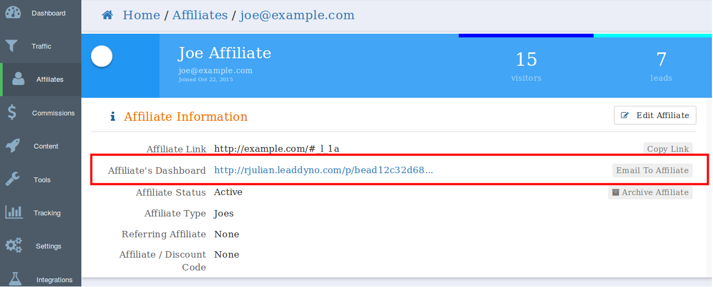
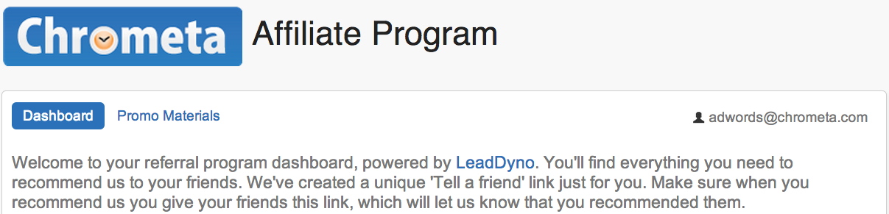
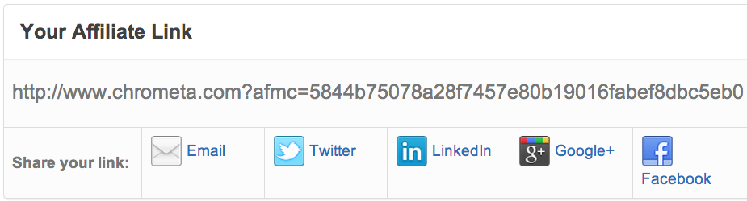
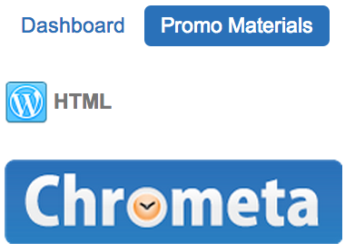

## The Affiliate Dashboard

Affiliates can track their own progress in real-time via their **Affiliate Dashboard**. You will provide them with a unique link to their dashboard, so that they can monitor their current clicks, leads, and conversions.

### Accessing the Affiliate Dashboard

When a new affiliate is created, LeadDyno will assign them two unique links. The first is their unique referral link, which they will use in promoting your product. The second is a link to their **Affiliate Dashboard**, where they can view their progress and upcoming payments, and access promotional materials.

To access the link from your end, click the **Affiliates** tab on the left, and then click on an Affiliate's ID to access their information. The URL listed above the Clicks, Leads, and Converts is the direct and secure link to their Affiliate Dashboard.

*The URL to the affiliate's dashboard.*

### Affiliate Dashboard Tour

However you allow your affiliates to access their dashboard - whether via a link to it on our site, an embedded version within your application, or a combination of the two - here's what they'll have access to when they log in.

### Affiliate Link Sharing

Affiliates can access their unique referral link below the welcome message in the dashboard. They can also share their link with a single click by clicking the social share button for Email, Twitter, LinkedIn, Google +, and Facebook.

Remember, you can provide the initial promotional copy for each medium via the [Social Content](/guide/affiliate-social-media-marketing.html) section.

### Tracking Progress and Payments

Affiliates can view their traffic, sales, and payment numbers in real-time by logging into their dashboard.

Additional Promotional Materials

Promotional materials for websites - such as banner ads - are located under the **Promo Materials** tab within the **Affiliate Dashboard**. The HTML for each banner already contains their affiliate link, so they can simply copy/paste the HTML directly into their site.

