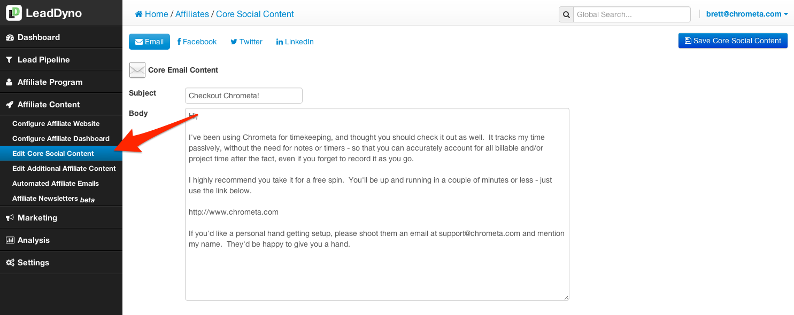
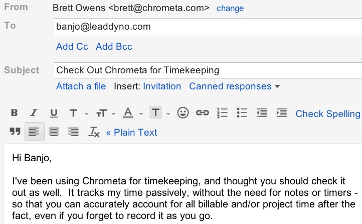
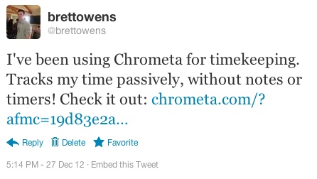
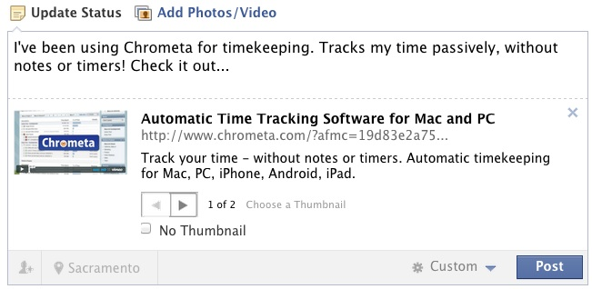
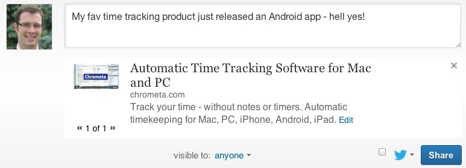

## Core Affiliate Social Content

On the affiliate dashboard, in addition to the the affiliates affiliate link, there are quick-share links that allow
your affiliates to easily broadcast your product information:

You can configure the content of each of these buttons in the 'Edit Core Social Content' section of LeadDyno:

### Editing Content

When you create content for email, Twitter, LinkedIn and Facebook, you can simply design it with links back to your
site.  LeadDyno will **automatically** detect links to your site and specialize them for each affiliate.  So, for
example, you might have email content like this

    Hi There,

    I wanted to tell you about a great product I've found.  It's called weebler, and it's amazing.

    Check it out!

      http://www.weebler.com

    I love weebler!

LeadDyno will take the link `http://www.weebler.com` in that email and append the affiliate's tracking code to it when they click the 'Email'
button on their dashboard.

### Email Example

Your marketing or content manager can quickly create predefined email templates for your affiliates. You write the copy,
or pull it from existing materials, and it’ll instantly become available to your affiliates.

Here’s the header and first paragraph of a referral email that was created using LeadDyno’s Email Referral Tool:

To send an email like this, your affiliate will simply click the **Email** button in their **Affiliate Dashboard**, and
this pre-written email – which includes their unique referral link – will be pulled up in their email client. The email
can be sent as-is, or edited prior to sending.

### Twitter Example

Promoted tweets are even easier to setup than emails – just input your 140 characters or less, and your affiliates can
Tweet to their followers. Because Twitter is a less invasive medium, you can change this copy quite often for frequent
Tweeting.

### Facebook Example

Facebook posts are the same to setup as Twitter - just make sure your links point to a domain owned by your Facebook
app. You can use more than 140 characters in a Facebook post.

Note that enabling Facebook posting requires that you get a Facebook Application ID.  This is not a trivial process
but we have documented the steps to do so **[here](http://www.leaddyno.com/blog/2013/05/30/getting-a-facebook-id.html)**

### LinkedIn Example

LinkedIn is similar to the previous two - except there is no 140 character requirement, nor is there an app ownership
requirement.

### Google+

Google Plus does not require any configuration because you cannot pass content through to it.  Affiliates will, however
be able to post a link back to your site on Google+.
