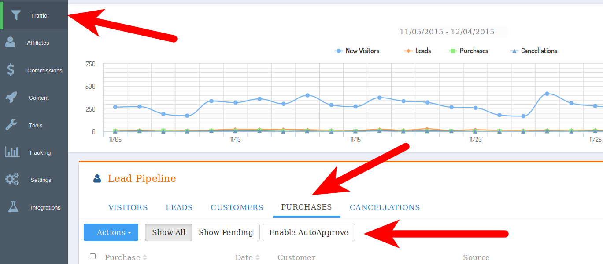

## Spark Pay Integration Guide

### Introduction

LeadDyno offers an integration with Spark Pay, making it incredibly easy to get an affiliate program going for
your Spark Pay store. After completing this guide, your LeadDyno account will be setup so that you will have complete
visibility into your store's visitors, leads and purchases, including crediting affiliates for traffic in which they
send to your store.

### Enable LeadDyno tracking in your Spark Pay store ###

To enable LeadDyno tracking code in your Spark Pay Store, you will need to add two different javascript
blocks to your site.  First, add the following on **All Pages**:


    
    


where YOUR_PUBLIC_KEY is replaced with your public LeadDyno API key.

Next, add this script to your **Thank You** page, **after the code above**:

<pre class="prettyprint">
    &lt;script
      LeadDyno.recordPurchase({purchase_code: ##ORDERID##, purchase_amount: ##ORDERSUBTOTAL##);
    &lt;/script>
</pre>

This will capture purchase information.

Note that purchases will be considered "pending" until you approve them on the LeadDyno purchase screen.

If you wish to avoid approving every purchase, you can enable "AutoApprove" of purchases by clicking
"AutoApprove" on the purchase screen:

### Conclusion ###

At this point your Spark Pay shop will be fully integrated with LeadDyno. Good luck selling!
