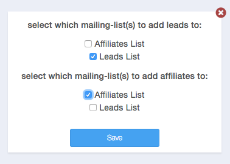

## AWeber Integration Guide

### Introduction

LeadDyno offers an integration with AWeber, automatically subscribing to your AWeber mailing list(s) whenever LeadDyno
captures a lead and/or a new affiliate signs up.

### Enable AWeber Integration Inside LeadDyno ###

Connecting your existing AWeber account is easy. Simply visit the **[CRM](https://app.leaddyno.com/integrations/crm)** tab
of the Integrations section, then click the **Connect** button on the AWeber card. 

This will open a new window and AWeber will ask you to confirm allowing LeadDyno to access your account.

Once you log into your AWeber account and click **Allow Access**, Aweber will provide you with an **authorization code**.

Return to LeadDyno and click the **Configure** button on the AWeber card, and paste in the entire value of your authorization
code from the AWeber page and click *Save*.

You are now connected to your AWeber account!

To pick which lists leads and/or affiliates are subscribed to, click the **Edit** button, make the selections and click
save.

### Conclusion ###

Integrating LeadDyno and AWeber is a very simple, yet powerful, process! Use AWeber to manage communications to 
your affiliates and/or leads with the benefit of synchronizing contact information in real-time with LeadDyno!

