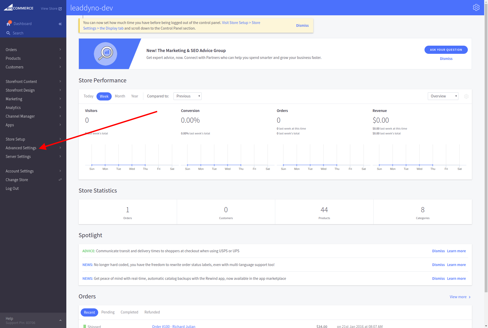
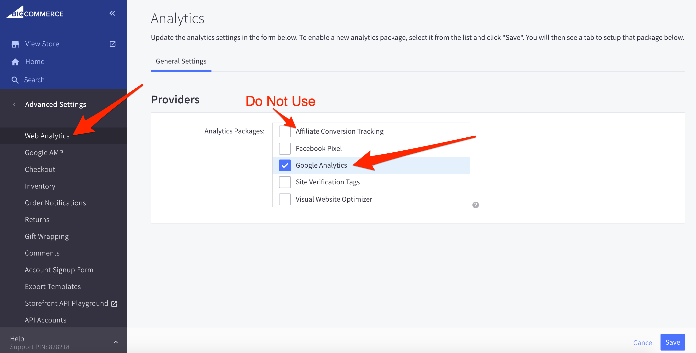
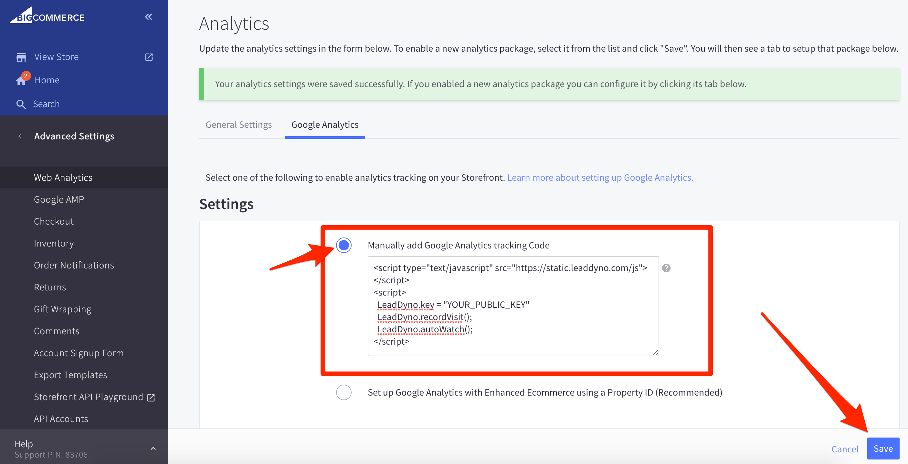
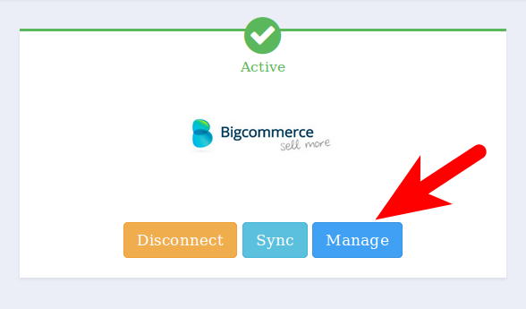
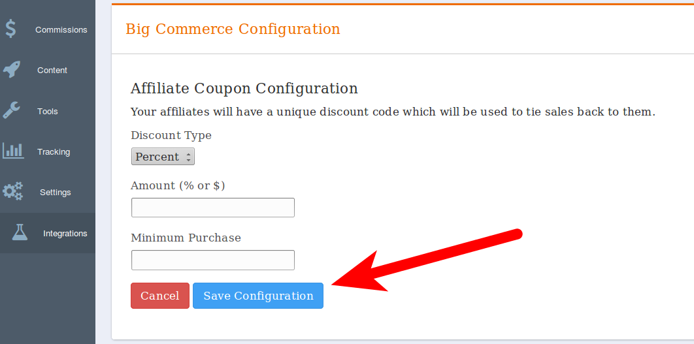

## Bigcommerce Integration Guide

### Introduction

LeadDyno offers an integration with the new Bigcommerce "Single Click" system, making it incredibly easy to get an affiliate program going for
your Bigcommerce store. After completing this guide, your LeadDyno account will be setup so that you will have complete
visibility into your store's visitors, leads and purchases, including crediting affiliates for traffic in which they
send to your store.

The Bigcommerce integration also synchronizes custom **Affiliate Codes** you assign to affiliates as Bigcommerce coupons.
This allows affiliates to pass around their affiliate code via offline means and still get credit for those sales.

This guide consists of several parts:

* Adding the LeadDyno Bigcommerce Single Click App
* Instructions on how to add the LeadDyn tracking code to your Bigcommerce store
* Setup Bigcommerce coupon settings (optional)

### Adding the LeadDyno Bigcommerce Single Click App ###

Navigate to the BigCommerce App Store and search for "LeadDyno". After finding the app, click the "Install" button
and you will be prompted to grant LeadDyno permission to access parts of your Bigcommerce store.

### Enable LeadDyno tracking in your Bigcommerce store ###

The LeadDyno tracking integration makes use of the built in 'Google Analytics' tracking setting of Bigcommerce. To
enable it, login to your Bigcommerce control panel, and select the **Advanced Settings** tab on the menu on the left side of the screen.

Under **Advanced Settings**,  choose the **Web Analytics** option.

Next, check the **Google Analytics** option in the Providers box, and click Save.

**Note**: Do NOT use the "Affiliate Conversion Tracking" option - this is for web based conversion tracking
which is not nearly as accurate as LeadDyno tracking which uses Bigcommerce webhooks.

A new tab will appear called **Google Analytics**. Click this tab, and make sure "Manually add Google Analytics tracking Code"
is selected.

Paste the code into the box that was given to you just after adding the LeadDyno app (or you can also use the following javascript)
into the **Tracking Code** field:





If you are not using the code given to you after adding the LeadDyno app, replace the word **YOUR_PUBLIC_KEY** with
your **public** API key found on the [LeadDyno Dashboard](https://app.leaddyno.com/settings/account).

After clicking Save, your Bigcommerce store will now have the tracking code on every page.

### Setup Bigcommerce Coupon Settings ###

If you want to provide your affiliates a coupon code that will track sales back to them, you can now set that up.

On the [LeadDyno Integration Settings](https://app.leaddyno.com/settings/integrations/e-commerce) page, there is a new button called
Manage Bigcommerce Discount Program. This is where you configure the default settings for new coupons that
LeadDyno creates for each affiliate.

On this page you can choose if the coupon should be a percentage or fixed amount, and if a minimum purchase is required
for the coupon to work. These are just the default settings for coupons that are created when you assign a discount/affiliate
code to an affiliate. You can always change individual coupon settings from within the Bigcommerce manage coupon tool
to change many more settings about the coupon.

From this screen you can also manually run a synchronization between LeadDyno and Bigcommerce. This happens several times
a day automatically, but if you have a recent Bigcommerce sale that you need to show up immediately in LeadDyno as a
purchase, you can manually start the job on this page.

### Conclusion ###

At this point your Bigcommerce shop will be fully integrated with LeadDyno. Good luck selling!
