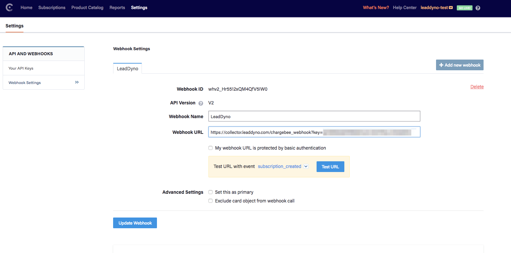

## Chargebee Integration Guide

### Introduction

This guide explains how to integrate Chargebee purchases into LeadDyno. The integration
between Chargebee and LeadDyno allows automated tracking of lead conversion, cancellation and affiliate compensation
for purchases made via Chargebee.

### Install JavaScript on Client Site

The first step to enable the integration is to install the following code on your own website:





### Configuration in Chargebee

Once you have installed the previous code on your site, the rest of the integration is a simple affair.
In Chargebee, simply visit the **Webhook Settings** page in the **Settings** section, and then do the following:

* Add new webhook
* Name: "LeadDyno"
* Webhook URL: https://collector.leaddyno.com/chargebee_webhook?key=YOUR_PRIVATE_KEY (Substitute your private Leaddyno API key here!)
* Select "V2"
* Click "Create Webhook"

It should look something like this:

And that's it!  

Chargebee will now stream purchase and cancellation information to LeadDyno.

### Conclusion

LeadDyno is able to seamlessly integrate with Chargebee. All Chargebee transactions are automatically sent to LeadDyno to track conversions,
cancellations and related affiliate compensation.
