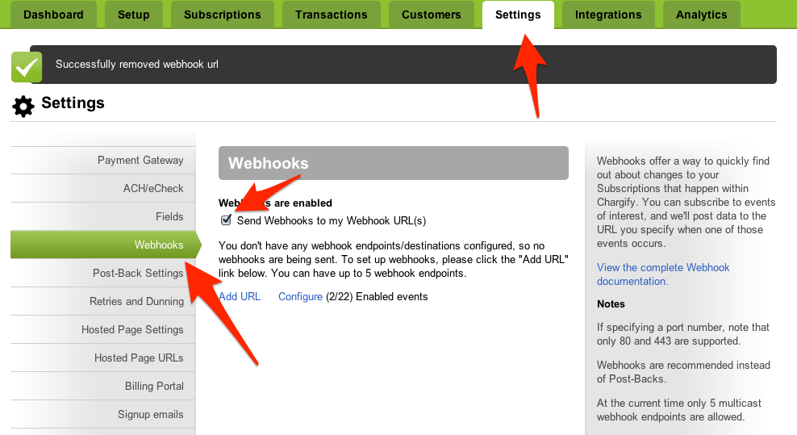
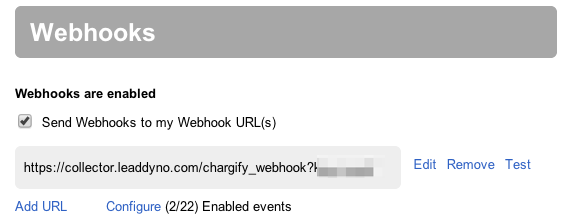
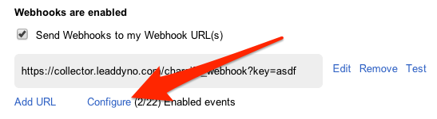
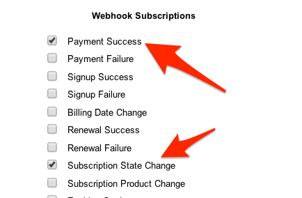

## Chargify Integration Guide

### Introduction

This guide explains how to integrate Chargify subscription information into LeadDyno.  The integration between
Chargify and LeadDyno allows automated tracking of lead conversion, cancellation and affiliate compensation for
purchases made via Chargify.

### Install Lead Tracking Code

The first step to enable the integration is to make sure that you are properly capturing lead sources through the
LeadDyno's [Lead Tracking](/installation.html#lead_tracking) functionality.

You can install this code either on your own payment/sign up form, or using
[Chargify's Hosted Pages](https://chargify.com/blog/chargify-hosted-pages-overview/).

**If using Chargiy's Hosted Pages**, include the code in the format as follows: 
```
jQuery.getScript( "https://static.leaddyno.com/js", function(){
    LeadDyno.key = "YOUR PUBLIC KEY";
    LeadDyno.recordVisit();
    LeadDyno.autoWatch();
})
```
Where **YOUR PUBLIC KEY** is the Public Key found on the [account settings page](https://app.leaddyno.com/settings/account).
#### Chargify Webhook Configuration

In order for LeadDyno to receive events about subscriptions made by your customers, you must configure a
Chargify Webhook to be sent to LeadDyno. To do so, first go to the **Webhooks** secion under the **Settings**
tab in Chargify and check the **Webhooks are enabled** checkbox:



next click **Add URL**



And enter the following URL:

<pre>
 https://collector.leaddyno.com/chargify_webhook?key=YOUR_PRIVATE_KEY
</pre>

Replace **YOUR_PRIVATE_KEY** with your private API key found on the [LeadDyno Dashboard](https://app.leaddyno.com/settings/account).

Finally, click **Configure**



and enable the **Payment Success** and **Subscription State Change** webhook events.



### Conclusion

That's it, you are now configured!

LeadDyno is able to seamlessly integrate with Chargify for subscription information. All Charfigy subscriptions are
automatically sent to LeadDyno to track conversions, cancellations and affiliate compensation.
