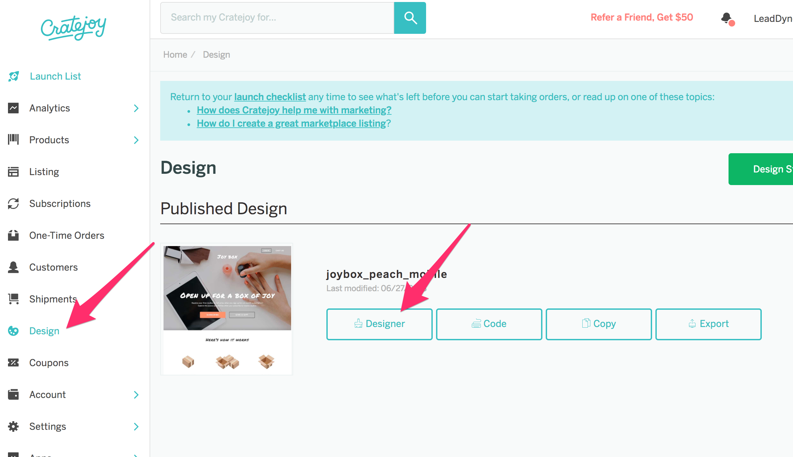
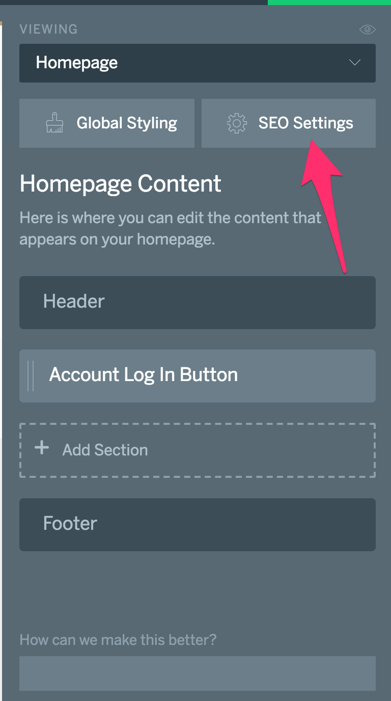
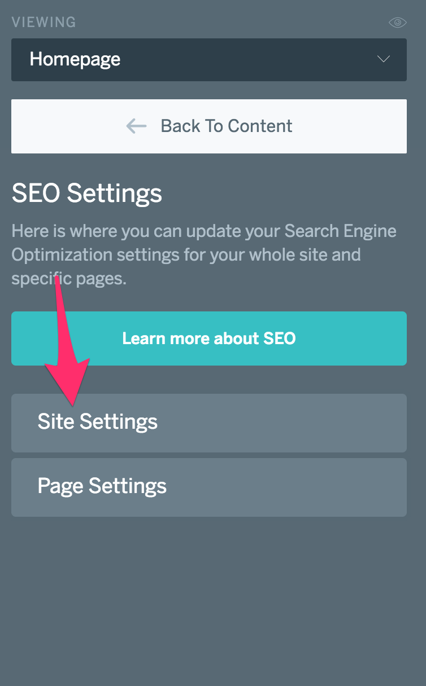
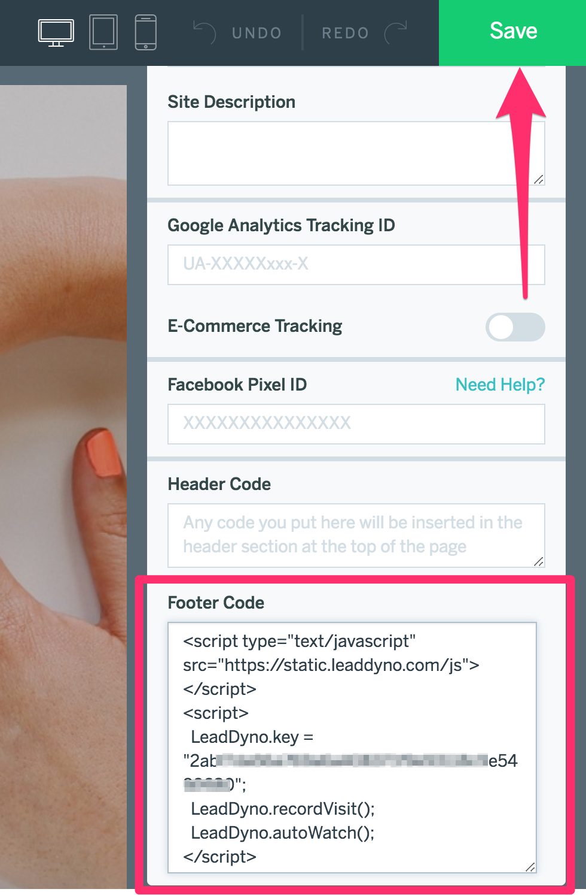
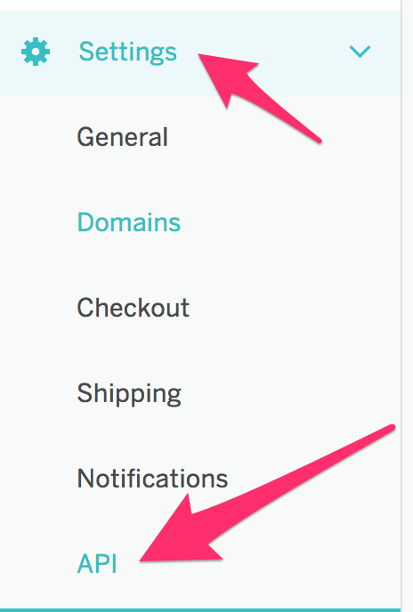
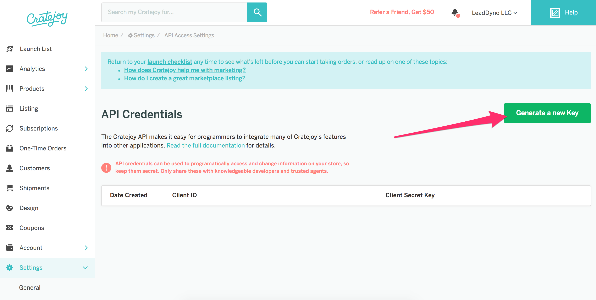
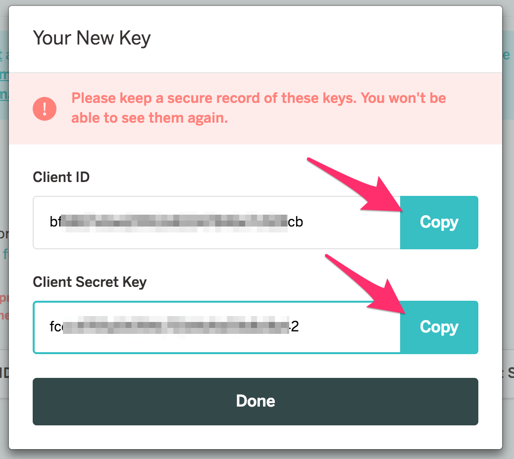
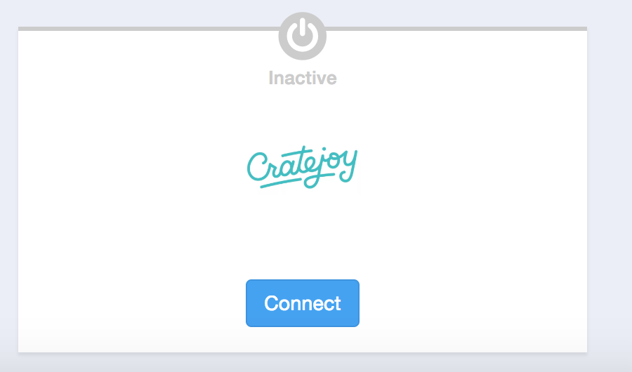
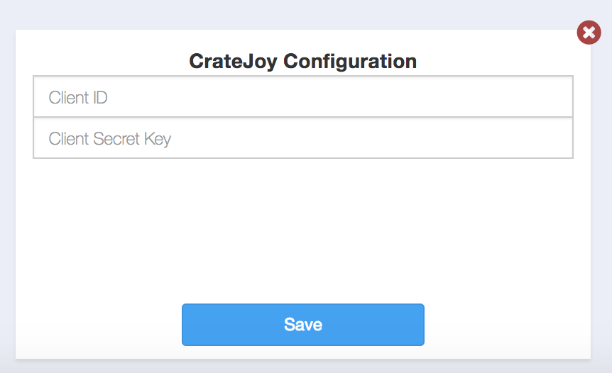
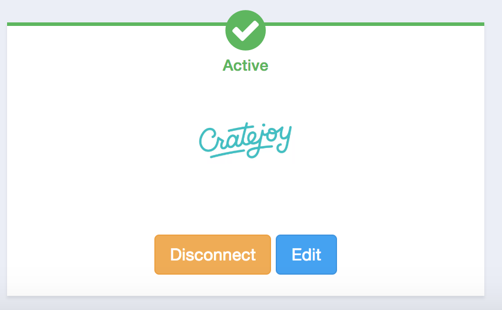

## Cratejoy Integration Guide

### Introduction


This guide explains how to integrate your [Cratejoy](http://www.cratejoy.com) E-Commerce site with LeadDyno.  The integration between
Cratejoy and LeadDyno allows automated tracking of visitors, leads, and purchases, along with affiliate
commission generation and cancellation based on the order status within Cratejoy.


### Adding LeadDyno Tracking To Your Cratejoy Theme

<p class="alert alert-info">
  <strong>Note:</strong> If you change your Cratejoy theme, you will need to repeat the steps in this section for the new theme.
</p>

#### Step 1
Go to the [Cratejoy Control Panel](http://my.cratejoy.com) and make sure you are logged into your account.

#### Step 2
After you are logged in, click the **Design** link on the left navigation menu, and select **Designer** for your
currently published theme.



If you are presented with a warning box about editing your live theme, click the **Edit Live Store** link, but be 
sure you are only making changes that are described in this document. If you are making other theme changes, it is
recommended that you copy your theme and make the changes there, and then publish the changed theme.

#### Step 3

Once in the designer, click the **SEO Settings** button:


and then click the **Site Settings** button:



#### Step 4

Scroll down to the bottom of the panel on the right to the **Footer Code** section and copy/paste the following
code into the box:
 
```
<script type="text/javascript" src="https://static.leaddyno.com/js"></script>
<script>
  LeadDyno.key = "**YOUR_PUBLIC_KEY**";
  LeadDyno.recordVisit();
  LeadDyno.autoWatch();
</script>
```

where **YOUR_PUBLIC_KEY** is replaced with your LeadDyno **Public** Key, available here:

 [https://app.leaddyno.com/settings/account](https://app.leaddyno.com/settings/account)



After pasting in the code, click the green **Save** button at the top-right of the page.

You can now leave the designer view and go back to the main [Cratejoy Control Panel](http://my.cratejoy.com).

### Create Cratejoy API Credentials 

#### Step 1

While back on the [Cratejoy Control Panel](http://my.cratejoy.com), select the **Settings** option in the left
navigation menu, and click **API**.




#### Step 2

From the API Credentials page, select the green **Generate a new key** button:



This will pop open a box with your new Client ID and Client Secret Key:



These are the values that need to be added to LeadDyno. Either copy/paste them to a text document, or leave this
browser tab open and open a new tab to the [LeadDyno Dashboard](https://app.leaddyno.com).


### LeadDyno Integrations Settings

* Make sure you are logged into your [LeadDyno](https://app.leaddyno.com) account.
* Go to the [LeadDyno E-Commerce Integration Settings](https://app.leaddyno.com/integrations/e-commerce).
* Click the **Connect** button for Cratejoy. 


 
* Paste the **Client ID** value from the previous section into the **Client ID** field.
* Paste the **Client Secret Key** value from the previous step into the **Client Secret Key** field.
* Click **Save**



* If the values were copied successfully, you should see the green **Active** checkmark indicating the connection was successful. 




### Conclusion

The Cratejoy integration is now connected, and as new Cratejoy orders are received, they will appear instantly within
LeadDyno!

If you have any problems creating the Cratejoy integration, we can help! Contact <a href="mailto:support@leaddyno.com">support@leaddyno.com</a>
or use our in-app Live Chat to connect with a support representative.
