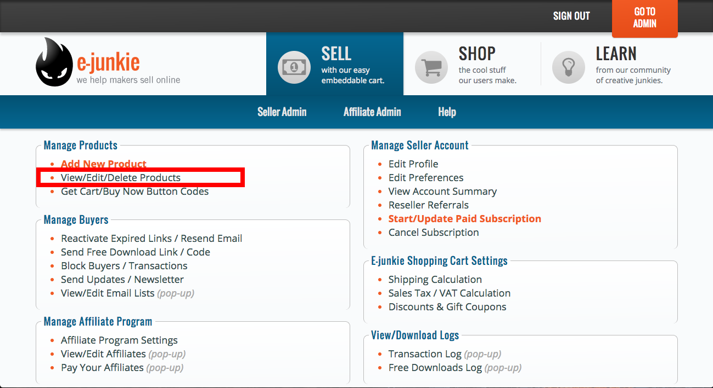
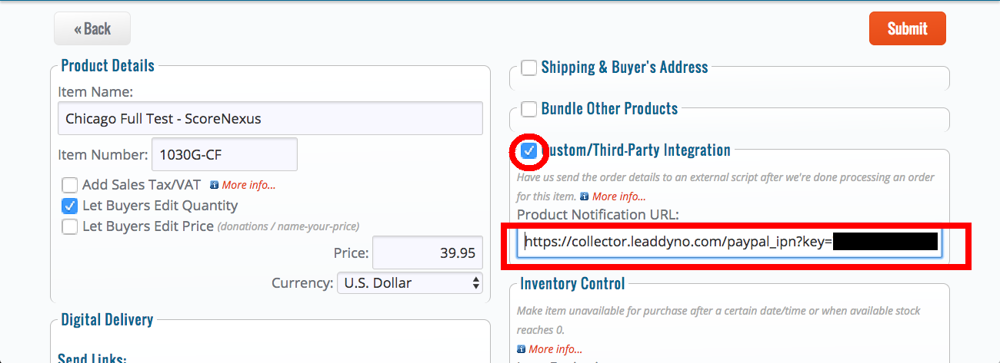

## E-Junkie Integration Guide

### Introduction

This guide explains how to integrate E-Junkie purchases into LeadDyno. The integration
between E-Junkie and LeadDyno allows automated tracking of lead conversion, cancellation and affiliate compensation for
purchases made via Paypal purchases configured with E-Junkie.

### Configuring An E-Junkie Product

In order to track your affiliate sales, you must configure each E-Junkie product to pass PayPal purchase
information through to LeadDyno.

#### Step 1 - Add LeadDyno's Static JS Script to Your Application

Add `` to all pages of your application. For faster loading times, put this after any jQuery code.

#### Step 2 - Edit Your Products

After logging in, go to Manage Products in the upper right corner, and then click View/Edit/Delete Products.

#### Step 3 - Select Your Product

Select the product you want to edit. Click View/Edit Product.

#### Step 4 - Integrate Your Product with LeadDyno

On your product details page, check the box for Custom/Third-Party Integration.

Then, fill out the field titled Product Notification URL. This should be set to

  `https://collector.leaddyno.com/paypal_ipn?key=YOUR_PRIVATE_KEY`

where **YOUR_PRIVATE_KEY** is replaced with your LeadDyno Private Key, available here:

[https://app.leaddyno.com/settings/account](https://app.leaddyno.com/settings/account)

Repeat this step with all your products.

#### Step 5 - Include LeadDyno Tracking Info In Your Product Link

The final step is to pass LeadDyno's tracking information through to E-Junkie.

To do so, add the following code to the E-Junkie web link your users use to purchase your product:

**&custom=\{\{leaddyno.visit.id}}**

So the following E-Junkie link:

**https://www.e-junkie.com/ecom/gb.php?i=P1&c=cart&cl=123**

Would need to be modified to

**https://www.e-junkie.com/ecom/gb.php?i=P1&c=cart&cl=123&custom=\{\{leaddyno.visit.id}}**

With this change, your product offering will now be integrated with LeadDyno.

### Conclusion

LeadDyno is able to seamlessly integrate with E-Junkie for transactions that occur on your E-Junkie site. All
E-Junkie transactions are automatically sent to LeadDyno to track conversions, cancellations and affiliate compensation.
