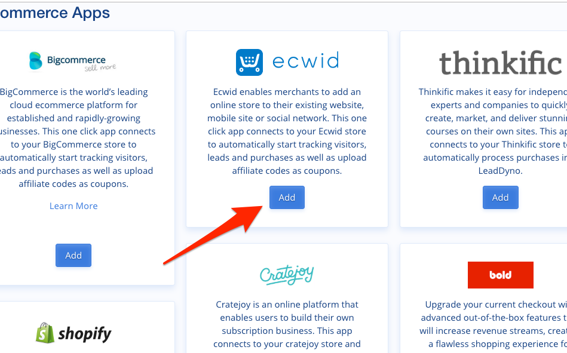

## Ecwid Integration Guide

### Introduction

LeadDyno offers a One-click integration with Ecwid-based stores, making it incredibly easy to get an affiliate program going for
your online shop.

### Connecting To Ecwid

First visit the **E-Commerce Services** Tab of the Apps section:

Or click [Here](https://app.leaddyno.com/integrations/store#apps-ecommerce) if you already have a LeadDyno account.

Find the Ecwid app, and click **Add**.

You will be redirected to your Ecwid store, possibly being asked to login if you are not already logged in. 

You will then be asked to grant permission to the LeadDyno app. Click **Accept**.

After a brief pause, you will be redirected back to LeadDyno, which should show you as connected:

### Coupon Code Integration

In order to track affiliates by coupon code with Ecwid, LeadDyno automatically uploads each new affiliate as a new Ecwid
coupon, using their affiliate code as the new coupon code. You can adjust the default settings for these new coupons
by clicking the **Manage** button.

Choose the discount type and amount, then click **Save**. 

That's all there is to it!

### Conclusion

At this point your Ecwid shop will be fully integrated with LeadDyno, which will track the source of all incoming leads,
including affiliates and tracking campaigns. New affiliates will automatically create a coupon in Ewcid that can be
used by affiliates. Orders using the affiliate's coupon will be credited to that affiliate.

