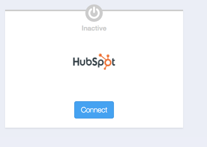
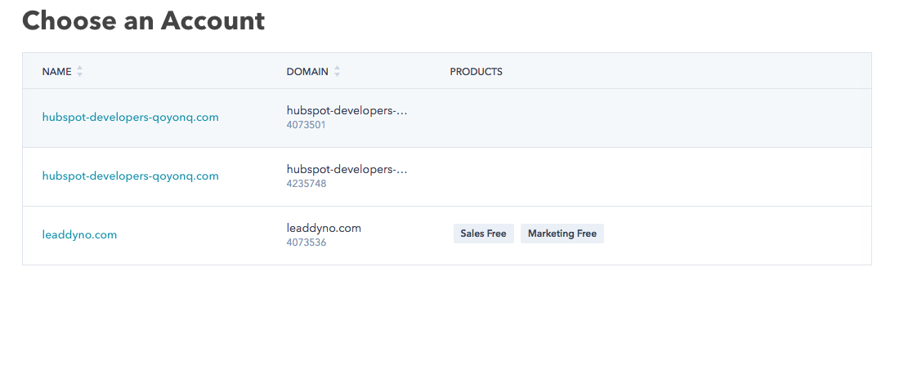
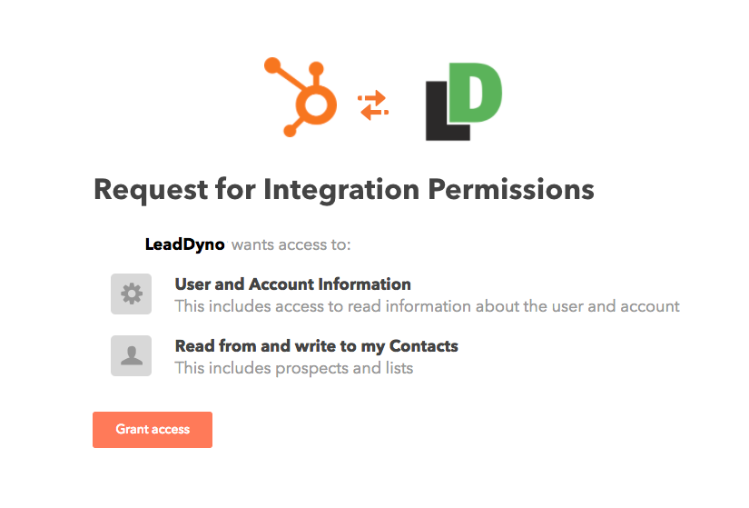
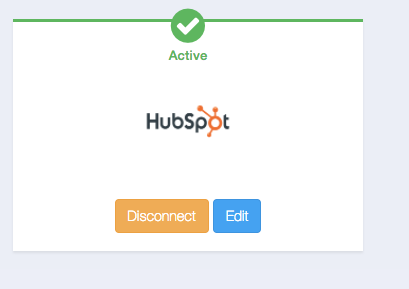
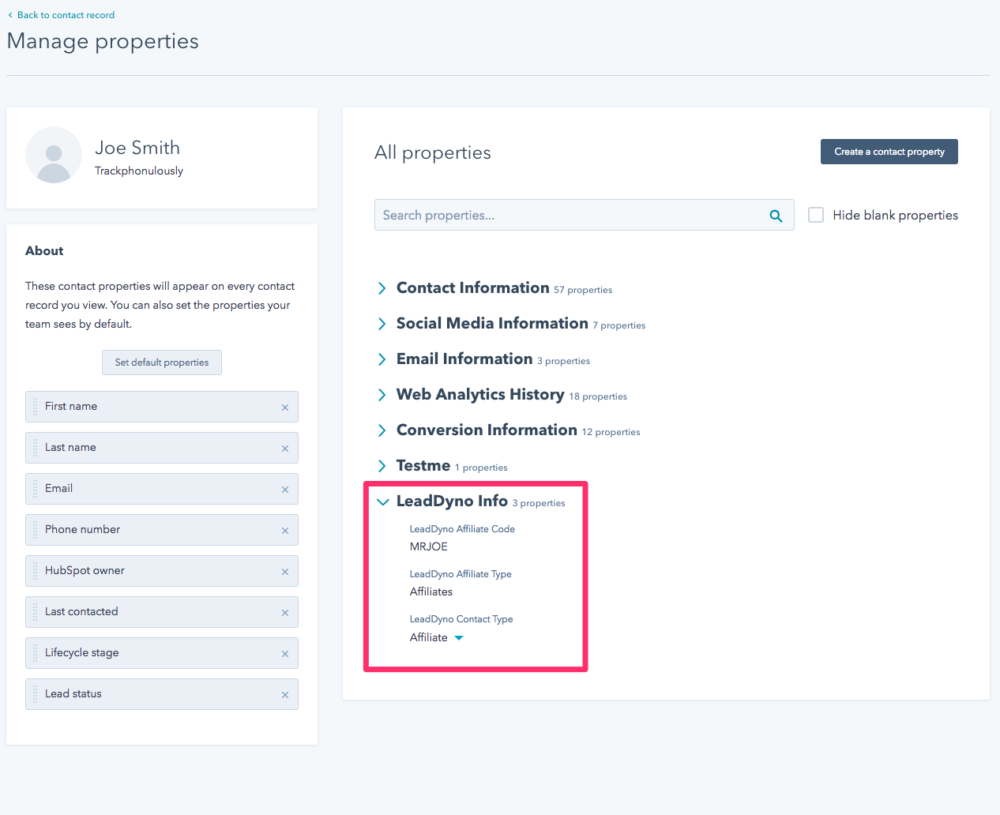

## Hubspot Integration Guide

### Introduction

LeadDyno offers an integration with Hubspot, allowing instant contact creation in your Hubspot account whenever LeadDyno
captures a lead and/or a new affiliate signs up.

### Enable Hubspot Integration Inside LeadDyno ###

Connecting your existing Hubspot account is easy. Simply visit the **[CRM](https://app.leaddyno.com/integrations/crm)** tab
of the Integrations section, then click the **Connect** button on the Hubspot card.

If you are new to LeadDyno, you can signup [here](https://app.leaddyno.com/signup).

Hubspot may prompt you to choose which account you wish to connect if you have more than one Hubspot account:

If so, select the Hubspot account you wish to use for the integration.

You will then be prompted to allow LeadDyno access to your Hubspot account. Click **Grant Access**.

You are now connected to your Hubspot account!

You can disconnect LeadDyno from sending leads to your Hubspot account by clicking the **Disconnect** button.

### New Contact Details ###

LeadDyno can upload new leads and/or affiliates to your hubspot contacts. All new contacts will have a new properties section
called **LeadDyno Information**:

Depending on if the contact is a lead or an affiliate, different fields will be automatically populated and remain
synchronized to your Hubspot contact record.

### Conclusion ###

Integrating LeadDyno and Hubspot is a very simple, yet powerful, process! Use Hubspot to manage communications to 
your affiliates and/or leads with the benefit of synchronizing contact information in real-time with LeadDyno!

