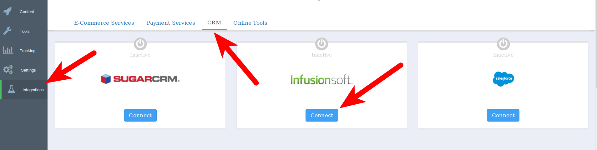

## Infusionsoft Integration Guide

### Introduction

LeadDyno offers an integration with Infusionsoft, making it incredibly easy to get an affiliate program going for
your Infusionsoft site. After completing this guide, your LeadDyno account will be setup so that you will have complete
visibility into your site's visitors, leads and purchases, including crediting affiliates for traffic in which they
send to your store.

### Enable LeadDyno tracking in your Infusionsoft site ###

To enable LeadDyno tracking code in Infusionsoft, you will need to add our javascript
to your site.  After logging into your admin account, go to **E-Commerce Setup**, then select the theme you want to add the code to, on the next page select **Edit** next to the theme name, select the **HTML Areas** tab, and insert the following Javascript in the **Custom Header** section:


    
    


where YOUR_PUBLIC_KEY is replaced with your public LeadDyno API key. Not sure what your public API key is? You can find it on your [LeadDyno tools page](https://app.leaddyno.com/tools).

### Set up Purchase Tracking ###

Setting up Purchase Tracking with Infusionsoft is done within our app. All you need is your [Infusionsoft API key](http://ug.infusionsoft.com/article/AA-00442/0/Infusionsoft-API-Key.html) and your Infusionsoft cart website (usually in the form of https://site-name.infusionsoft.com).

With that information inserted into the form, click **Test Connection**. If everything is correct, it will respond with "Connection Successful".

Now check **Sync Leads** and **Sync Purchases**, if you'd like to begin tracking purchases and leads. Once done, click **Sync Purchases Now** to sync previous purchases into LeadDyno.

**NOTE:** If you have enabled auto affiliate invitation emails before syncing purchases, LeadDyno will email all of your past purchases with invitations to join your affiliate program! To prevent this, disable [automated affiliate invitations](https://app.leaddyno.com/affiliate_emails/viral).

### Conclusion ###

At this point your Infusionsoft site will be fully integrated with LeadDyno.
