## Paypal MassPay Integration Guide

### Introduction

With PayPal MassPay you can pay out a large number of affiliates very easily and quickly. It takes a few steps to setup
your PayPal account to be able to do automatic MassPay payments, but once it is setup, the process to pay out affiliates
is very simple.

  <strong>Note:</strong> The PayPal Payouts/MassPay integration requires that you have a PayPal business account. Click <a href="https://developer.paypal.com/docs/integration/direct/payouts/#enable-payouts" target="_blank">Here</a> for more information.

### Creating the PayPal Developer App

#### Step 1
Go to the [PayPal Website](http://www.paypal.com) and make sure you are logged into your account.

#### Step 2
After you are logged in, Go to the [PayPal Developer Website](http://developer.paypal.com).

You should see your name at the top-right of the page. Click it, and select **Dashboard**.
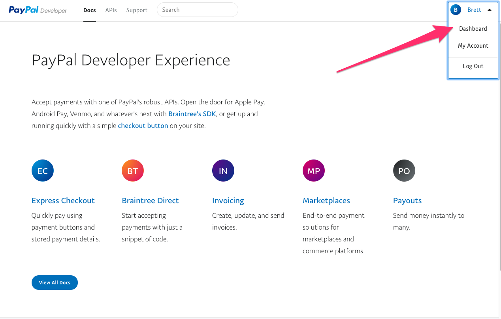

#### Step 3

Confirm your account has payouts enabled by clicking the **My Account** option on the left menu and confirming there
is a green checkbox in the **Live** column for the **Payouts** item. If there is an **Enable** link instead, click the
link and fill out the information Paypal requires to enable Payouts. This may take a few days to Paypal to process.
You can continue with this guide while they process your forms, but actual payouts will not work until this is enabled
and a green checkmark is on this page. 

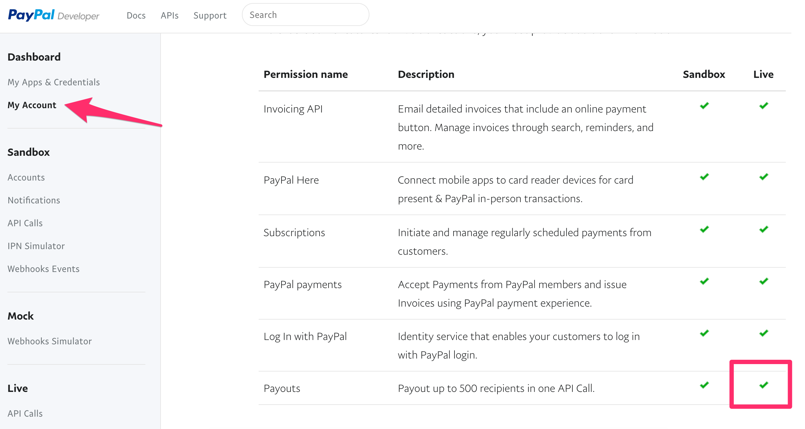

#### Step 4

Click back on the **My Apps & Credentials** menu item, then scroll all the way down to the **REST API apps** section and select **Create App**.

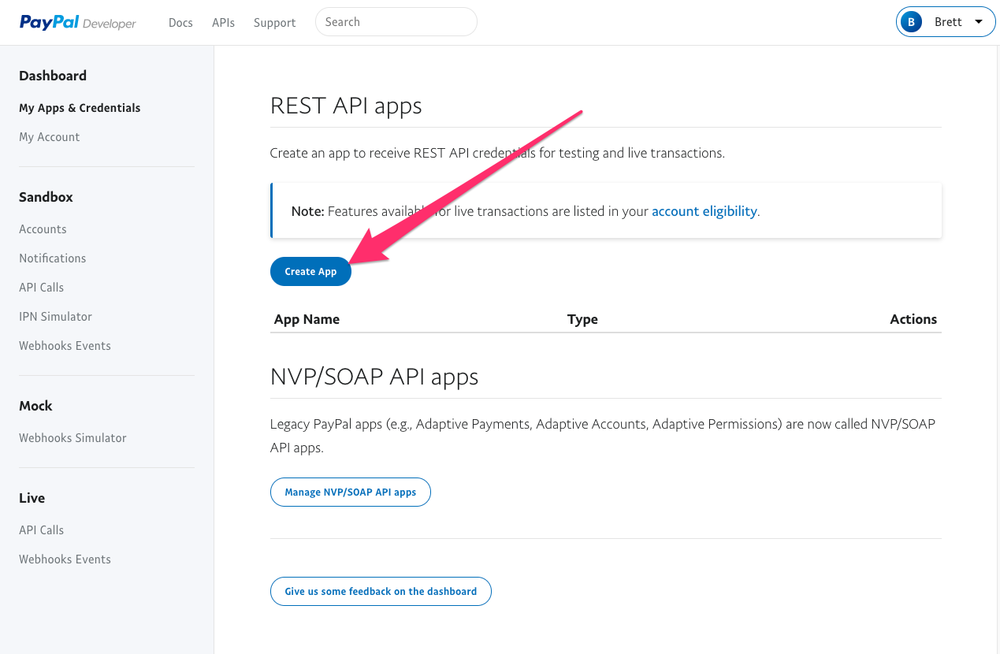 
 
 
#### Step 5
 * Under **App Name** type in **LeadDyno Affiliate Payout**
 * Select any value from the **Sandbox developer account** dropdown box.
 * Click **Create App**
 
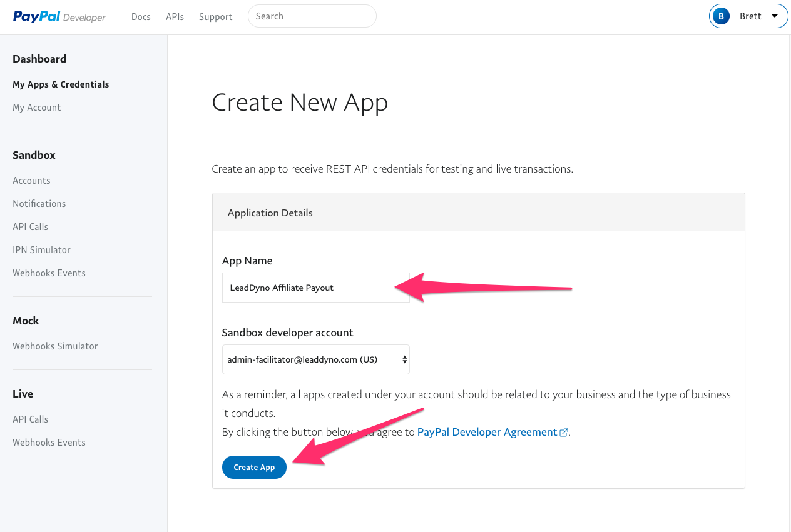

#### Step 6
* Make **SURE** to select **Live** at the top right of the page!
* Click **Show** under the **Secret:** link.
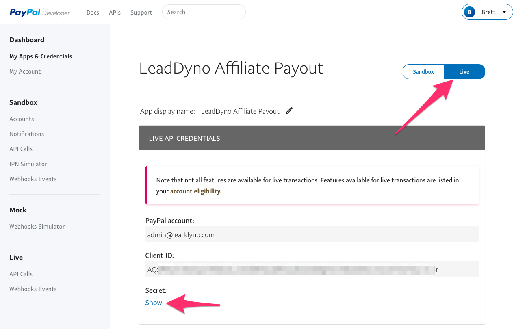

#### Step 7
The two values you need are the values under **Client ID** and the **Secret**. Copy and paste these values into a new 
temporary notepad document.

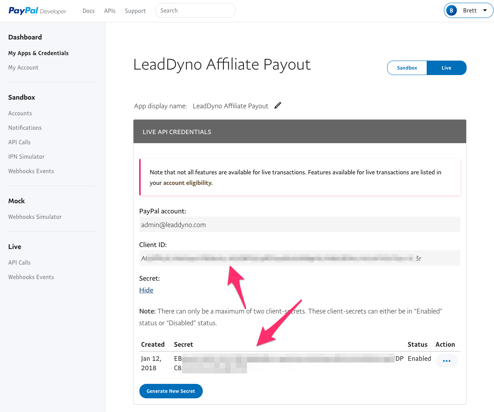

### LeadDyno Integrations Settings

* Make sure you are logged into your [LeadDyno](https://app.leaddyno.com) account.
* Go to the [LeadDyno Payment Services Integration Settings](https://app.leaddyno.com/integrations/payment).
* Click the **Connect** button for PayPal MassPay 

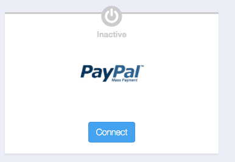 
* Paste the **Client ID** value from the previous step into the **Paypal App Client ID** field.
* Paste the **Secret** value from the previous step into the **Paypal App Client Secret** field.
* Click **Save**

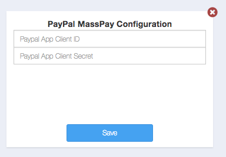

* If the values were copied successfully, you should see the green **Active** checkmark indicating the connection was successful. 

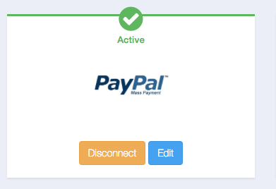

### Making Affiliate Payments

* Go to the [Commissions](https://app.leaddyno.com/affiliate_payments/pay) page within the LeadDyno app.
* You can now select multiple affiliate commissions and choose **Pay via Payal Mass Pay** in the dropdown box, and
the payment will be sent via MassPay!

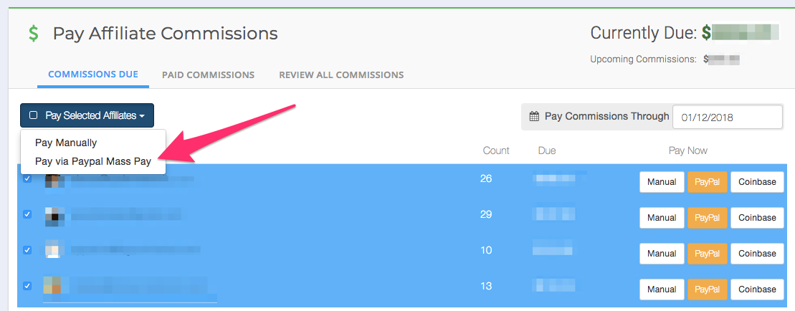

### Upgrading

If you have already been using PayPal MassPay and have not upgraded the connection since [PayPal Deprecated the old Mass Pay API](https://developer.paypal.com/docs/classic/mass-pay/gs_MassPay/)
you will see the following warning on your PayPal MassPay integrations settings:

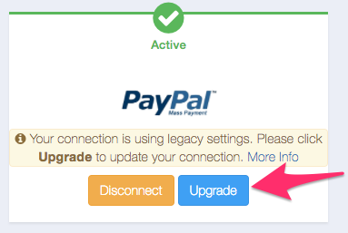

To fix your connection and avoid any potential distruption in MassPay functionality as PayPal end-of-lifes the old API
click the **Upgrade** button.

You will be prompted for the **Client ID** and **Secret** settings as detailed earlier in this document. Follow the steps
above to create a PayPal REST API App and then input the settings.

Click **Save** and LeadDyno will confirm the new settings can be successfully used to make MassPay payments and
upgrade your connection.

The warning will go away and you can make MassPay payments just as before!

### Conclusion

The PayPal MassPay integration is a quick and easy way to pay large numbers of affiliates with minimal effort!

If you have any problems creating the PayPal developer app, we can help! Contact <a href="mailto:support@leaddyno.com">support@leaddyno.com</a>
or use our in-app Live Chat to connect with a support representative.
