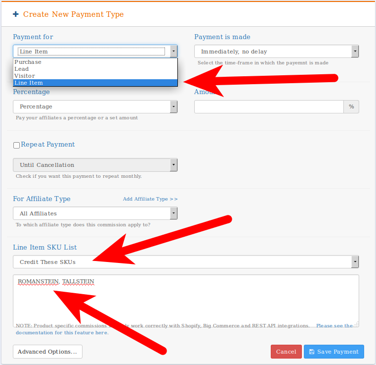
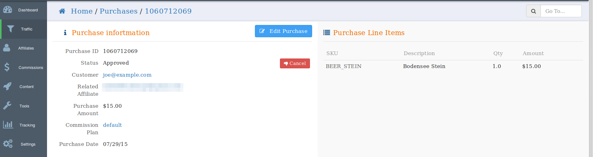

## Per-Product Commission

For Shopify and Bigcommerce users, we now offer the ability to seamlessly track commissions from individual products within purchases. This feature will allow you to specify which products create commissions, the amount of commission per product, and exclude certain products from commission plans. 

## Setup

To set up per product commissions, simply follow the process for setting up a normal commission plan. Select "Line Item" for **Payment For**, fill out the **Payment Type** and **Amount** as normal and add the SKUs for the products that you would like the commission to apply to. If you'd like to specifically exclude certain SKUs and provide commissions on all others, simply select the "Exclude these SKUs" box. 

To ensure successful product tracking, make sure to set up your SKUs for each individual product in Shopify or Bigcommerce as shown below. 

## Product Details

Per product support allows you to now see the individual items purchased on any purchases detail page. You're able to see the SKU, product description, quantity, and price associated with individual products in an order.

