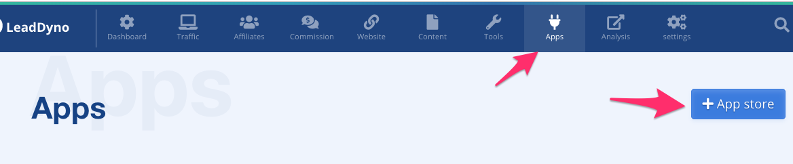
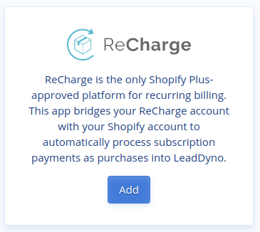
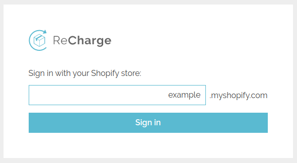
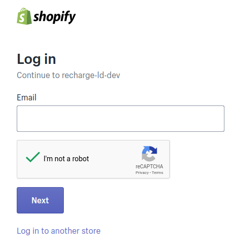
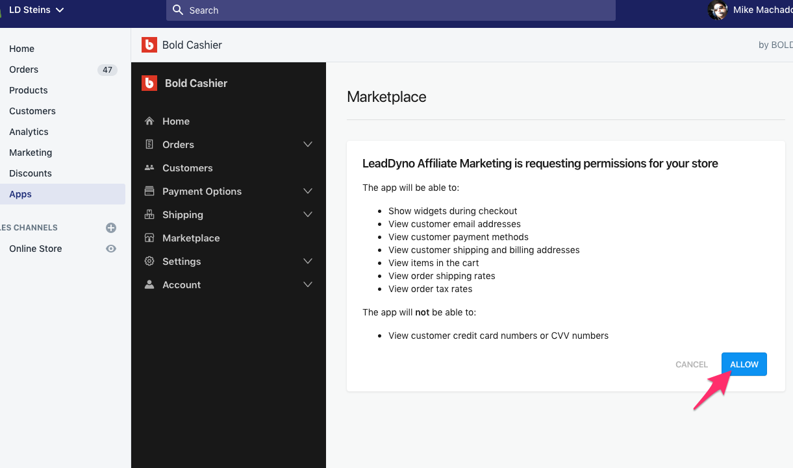

## Recharge Integration Guide

### Introduction

LeadDyno offers a One-click integration with the Recharge subscription management system. At this time, LeadDyno
only supports Recharge on the Shopify platform.

Before connecting the Recharge integration, make sure you have already connected your LeadDyno account to 
your Shopify store. You can confirm this by looking at your list of installed apps from your Shopify administration
dashboard, or looking at the list of existing LeadDyno installed apps/integrations and seeing the Shopfiy integration
listed as connected. For more help, see our [Shopify Integration Guide](https://docs.leaddyno.com/shopify-integration-guide.html).

Also, make sure you are already logged into the Shopify admin panel for the store you are adding the Recharge
integration. 

### Connecting To Recharge Cashier

First visit the **App Store** from within LeadDyno:

Scroll down to the E-Commerce Apps and find the Recharge app and click **Add**.

Fill in your Shopify Shop URL on the recharge site

You will be redirected to your Shopify store administration interface, and if you are not already logged in, you may
be asked to login. 

After logging in, you will be asked to allow LeadDyno to access your Recharge account. 

After clicking **ALLOW**, the connection will be established, and you will now see the Recharge app listed in the Installed
Apps. Everything is connected!

### Conclusion

At this point your, as purchases come to your store, LeadDyno will receive notices from both Shopify and Recharge and we
will automatically do all the behind the scenes work to associate affiliate subscriptions to the correct affiliate!

To learn more about LeadDyno in general, check out our extensive list of other documentation [HERE](https://docs.leaddyno.com/).