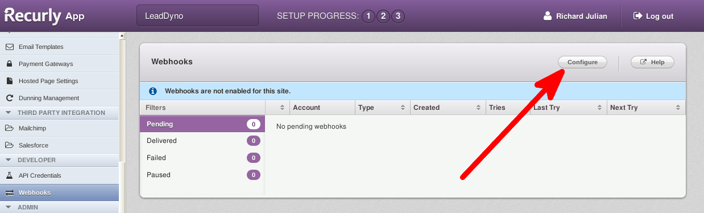
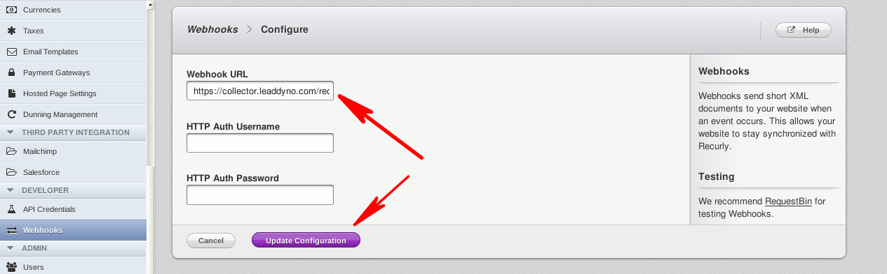

## Recurly Integration Guide

### Introduction

This guide explains how to integrate Recurly purchases and subscription into LeadDyno if you are **not** using the
Recurly Hosted Payment Page system. The integration between Recurly and LeadDyno allows automated tracking of lead
conversion, cancellation and affiliate compensation for purchases made via Recurly.

*If you are using Recurly Hosted Payment Pages, please see [this documentation](/recurly-integration-guide.html) instead*

### Install Lead Tracking Code

The first step to enable the integration is to make sure that you are properly capturing lead sources through the
LeadDyno's [Lead Tracking](/installation.html#lead_tracking) functionality.  In this configuration
Recurly provides purchase and cancellation information only, so the standard LeadDyno lead tracking mechanism must be
configured as well.

#### Recurly Webhooks

In order for LeadDyno to receive events about purchases made by your customers, you must configure a Recurly Webhook 
to be sent to LeadDyno. This is done in Recurly by selecting **Webhooks** in the left menu (located near the bottom-left
in the **Developer** section).

You will be presented with the following screen:

Click on the **Configure** button, and then in the Webhook URL text field, put in the following:

<pre>
 https://collector.leaddyno.com/recurly_push_notification?key=YOUR_PRIVATE_KEY
</pre>

Replace **YOUR_PRIVATE_KEY** with your private API key found on the [LeadDyno Dashboard](https://app.leaddyno.com/settings/account).

Leave **HTTP Auth Username** and **HTTP Auth Password** fields blank.

You should see something like the following:

Click **Update Configuration** and you are done configuring Recurly.

### Conclusion

LeadDyno is able to seamlessly integrate with Recurly for transactions. All Recurly transactions are automatically sent
to LeadDyno to track conversions, cancellations and affiliate compensation.
