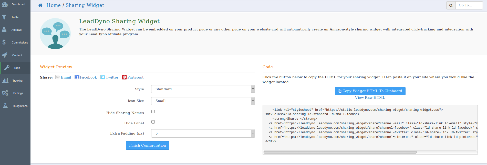

## Sharing Widget

LeadDyno’s Social Media [Sharing Widget](https://app.leaddyno.com/sharing_widget) is a “one-click” way for your website visitors to share your product on social media… such as:

* Facebook
* Twitter
* Pinterest 
* Email

It works just like the social media sharing buttons you see on Amazon.com when you view or buy a product there:

When your website visitors click one of the sharing buttons, they will    automatically be logged into their account on that platform. And they’ll have a message ready to post for their friends and followers that is specific to your product.

For example, if one of your visitors clicks the Facebook button, they’ll be logged into Facebook with a Wall Post ready to go.

That Wall Post will contain your product information. LeadDyno’s Sharing Widget is “smart” enough to pull these details from your page automatically (again, just like Amazon).

The sharing links are tracked by LeadDyno’s affiliate tracking code. If the person is already an affiliate of yours, they will get credit for every click and purchase they send your way as a result of their “share.”

(And, coming soon – if the person is not yet a member of your affiliate program, they’ll be asked if they’d like to join at this time. So that they can also be compensated for any clicks or purchases that result from their “social share.”)

## Installation

Installation involves configuring the [sharing widget code](https://app.leaddyno.com/sharing_widget/configure) to fit your desired styling and then simply copy and paste the code onto a page that you'd like a sharing widget. 

If you're using an e-commerce integration, this may involve editing a product page's theme template to include our sharing widget. 

## Sharing Tracking

When an affiliate or customer chooses to share your page, it will be shown on your Sharing Widget dashboard, including how many visits and leads were created due to the share. If the share came from an affiliate, you will see the source as that affiliate's name, if shared by a customer in general, you will see 'Unknown' as the source.

