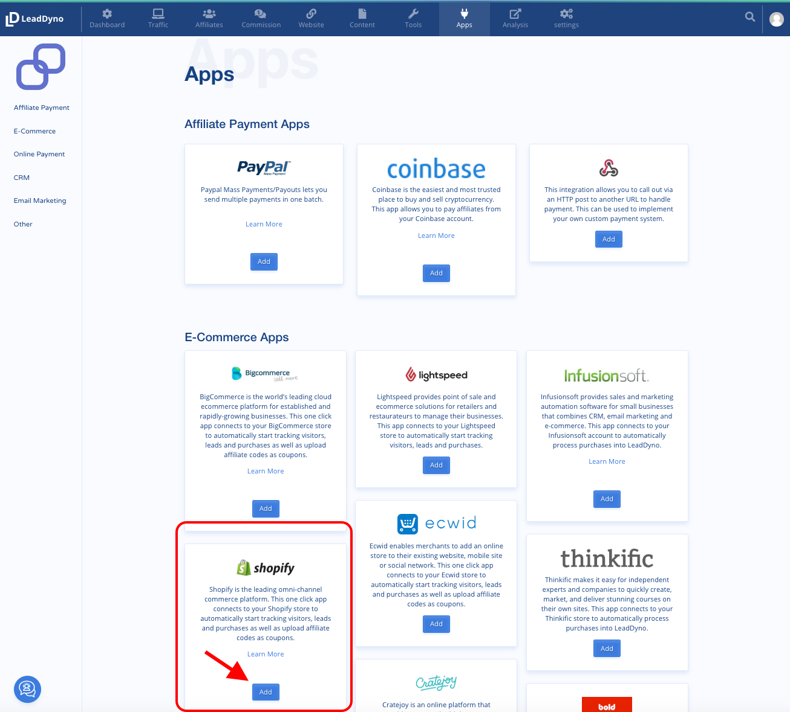
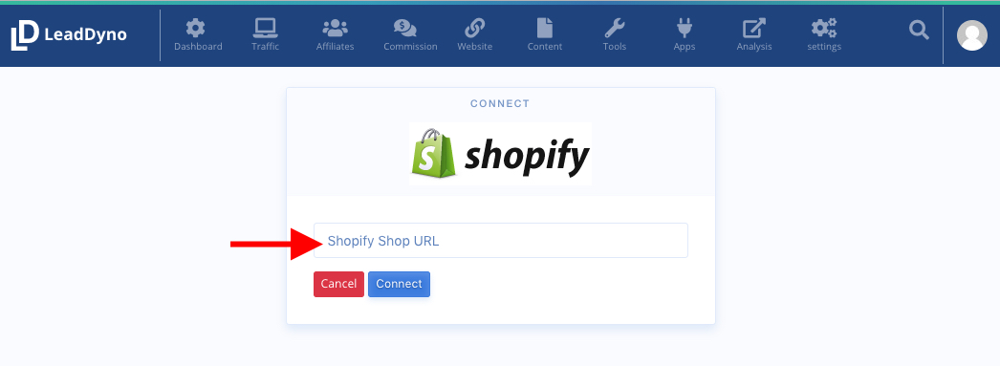
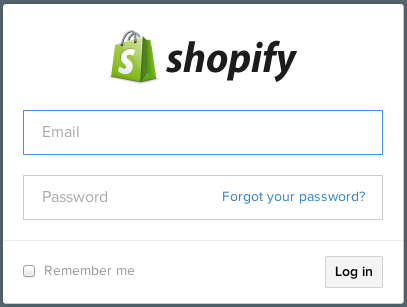
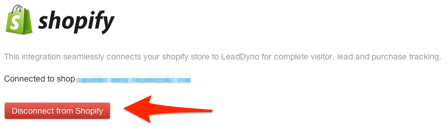

## Shopify Integration Guide

### Introduction

LeadDyno offers a One-click integration with Shopify, making it incredibly easy to get an affiliate program going for
your online Shopify shop.

### Connecting To Shopify

First visit the **E-Commerce Services** Tab of the Apps section:

Or click [Here](https://app.leaddyno.com/settings/integrations/e-commerce) if you already have a LeadDyno account.

Next fill in your Shopify shop name (e.g. 'yourshop.myshopify.com'):

then click **Connect to Shop**:

You will be asked to log into Shopify:

Once you log in, after a brief pause, you will be redirected back to LeadDyno, which should show you as connected:

And **that's it**!

You can disconnect LeadDyno from your Shopify shop by clicking the **Disconnect from Shopify** button.

### Coupon Code Integration

In order to track affiliates by coupon code with Shopify, you simply create coupon codes manually in Shopify and assign the exact coupon codes to the corresponding affiliate in the 'Edit Affiliate' page.

### Conclusion

At this point your Shopify shop will be fully integrated with LeadDyno, which will track the source of all incoming leads,
including affiliates and tracking campaigns.
