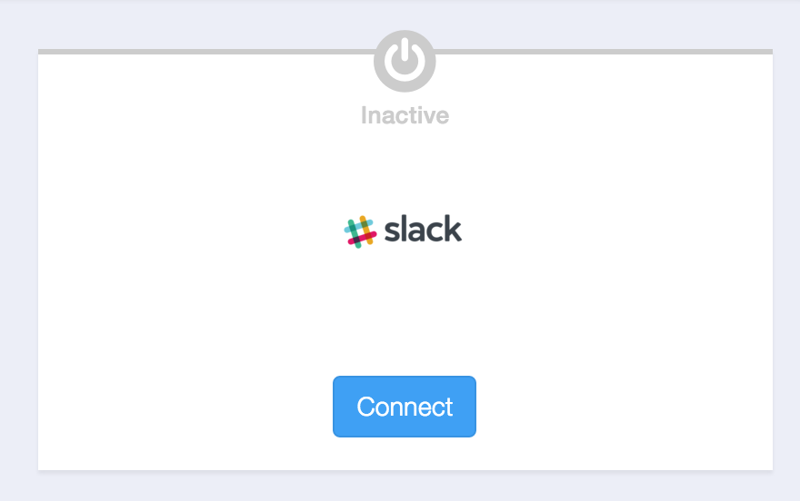
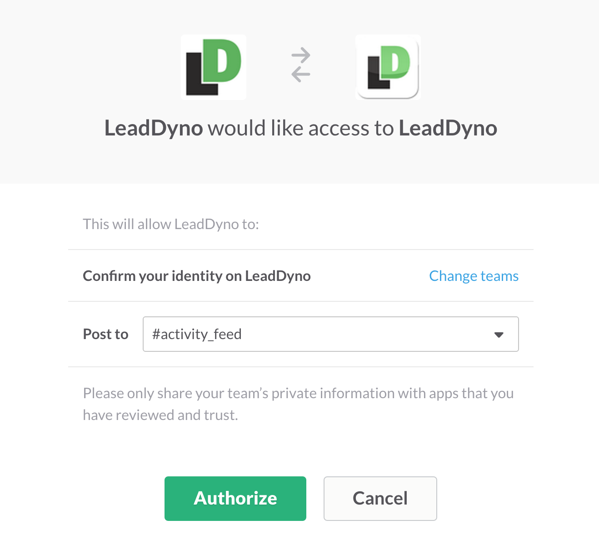
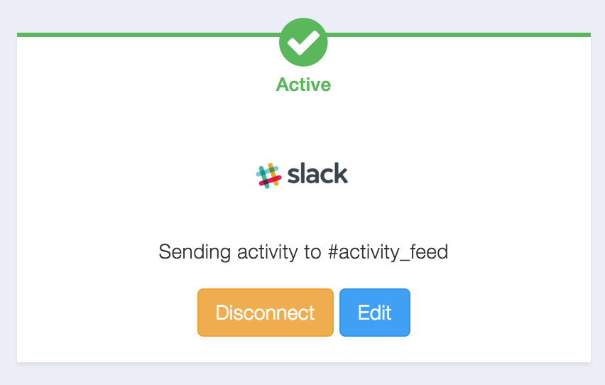
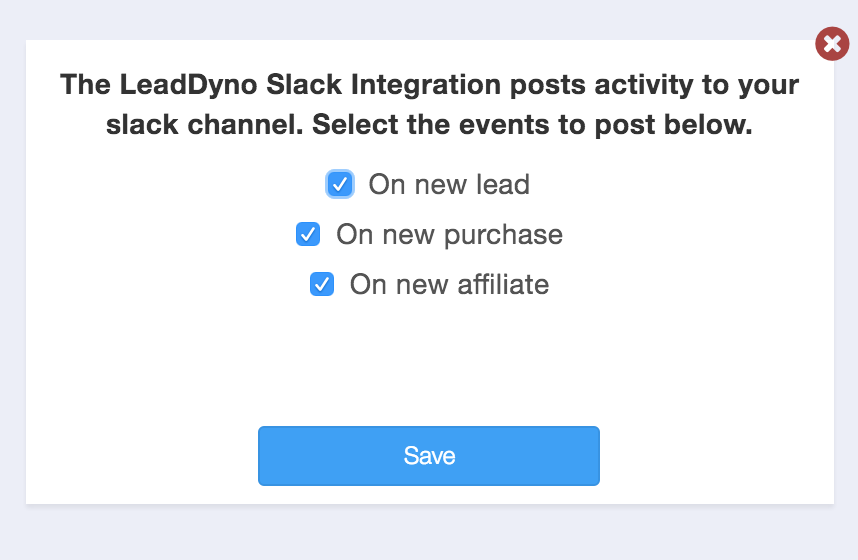

## Slack Integration Guide

### Introduction

LeadDyno is an affiliate tracking and referral marketing system which is simple to install via the many e-commerce integrations.
For more informaiton about LeadDyno, visit the [LeadDyno Website](http://www.leaddyno.com)

The LeadDyno Slack app allows you to get LeadDyno activity posted to a Slack channel such as new leads, purchases and affiliate signups.

### Connecting To Slack

First visit the **Online Tools** Tab of the Integrations section:

If you have a LeadDyno account, click [here](https://app.leaddyno.com/integrations/tools). If you are new to LeadDyno, you can signup [here](https://app.leaddyno.com/signup).

then click **Connect**:

You will be asked to log into Slack:

Once you log in, after a brief pause, you will be redirected back to LeadDyno, which should show you as connected:

If you want to choose exactly what LeadDyno activity is posted to your Slack channel, you can customize it by pressing the **Edit** button,
and then choosing the events you want to be sent to Slack.

You can disconnect LeadDyno from sending Slack notifications by clicking the **Disconnect** button.

### Conclusion

That's it! You will now get real-time notifications in your Slack channel when activity happens on your site.
