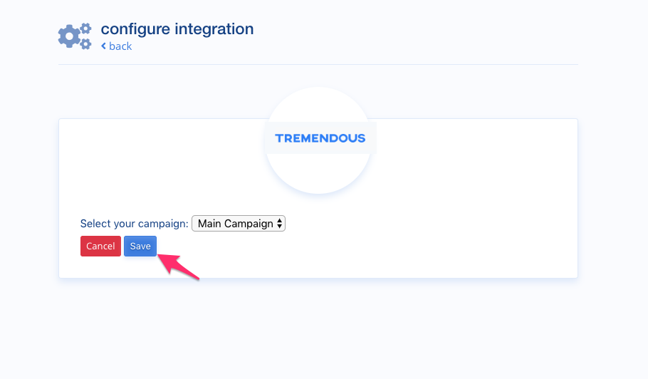

## Tremendous Integration Guide

### Introduction

This guide explains how to integrate Tremendous LeadDyno in order to pay affiliates via gift cards or bank
transfers. 

### Sign Up For Tremendous

If you do not already have a Tremendous account, you can sign up <a href="https://app.tremendous.com/rewards/auth/signup?referrer=ac461717aa1072850ba21843c31a59f7e9d64199fa9d5866e7bc5c1e71dfbd34" target="_blank">HERE</a>.

### Setup Your Tremendous Account

Detailed information on how to configure your Tremendous account can be found in their <a href="http://help.tremendous.com/en/" target="_blank">help documentation</a>. You will need
to add funds to your account, and setup at least one campaign to decide which gift cards an affiliate can choose and if you
want to allow bank transfers. 

### Connecting to Tremendous

First visit the **App Store** from within LeadDyno:

Scroll down to the Affiliate Payment Apps and find the Tremendous app and click **Add**.

You will be redirected to Tremendous, and if you are not already logged in, you may
be asked to login. After logging in, you will be asked to allow LeadDyno to access your Tremendous account. 

After clicking **AUTHORIZE**, the connection will be established, and you will now see the Tremendous app listed in the Installed
Apps. Everything is connected, you can now configure which Tremendous campaign to use by clicking **Edit**.

### Configure Tremendous Settings

From the Edit page, you can select your Tremendous campaign to use for affiliate payouts. This determines which gift 
cards and/or if a bank payout option is offered to the affiliate when they redeem their payout.

### Making Affiliate Payouts

Once connected to Tremendous, you can now pay commissions using Tremendous. Navigate to the Commissions page from within
LeadDyno. You can pay multiple affiliates at once using Tremendois. Select all the currently due commissions you wish 
to pay by checking the box next to the affiliate(s) you wish to pay.

In the **Pay Selected Affiliates** dropdown, select **Pay via Tremendous payout**.

You will receive a confirmation the payouts were successfully submitted to Tremendous.

Clicking on the **Paid Commissions** tab will show you the payouts paid via Tremendous, along with their
reward number that matched up to the reward from the app.tremendous.com interface.

### Conclusion

LeadDyno seamlessly integrates with Tremendous for bulk affiliate payouts. Tremendous offers a number of gift
card choices as well as using bank transfers to pay your affiliates!