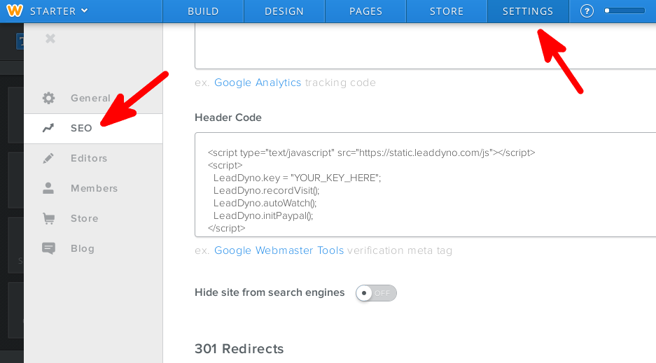

## Weebly Integration Guide

### Introduction

LeadDyno offers an integration with Weebly, making it incredibly easy to get an affiliate program going for
your Weebly site. After completing this guide, your LeadDyno account will be setup so that you will have complete
visibility into your site's visitors, leads and purchases, including crediting affiliates for traffic in which they
send to your store.

### Enable LeadDyno tracking in your Weebly site ###

To enable LeadDyno tracking code in Weebly, you will need to add our javascript
to your site.  After logging into your admin account, go to **Settings**, then select the **SEO** tab, insert the following Javascript in the **Header Code** section:


    
    


where YOUR_PUBLIC_KEY is replaced with your public LeadDyno API key. Not sure what your public API key is? You can find it on your [LeadDyno tools page](https://app.leaddyno.com/tools).

Follow the corresponding instructions for purchase tracking from our [installation page](installation.html#purchase_tracking).

An installation using our Paypal integration is documented below:

### Conclusion ###

At this point your Weebly site will be fully integrated with LeadDyno.
