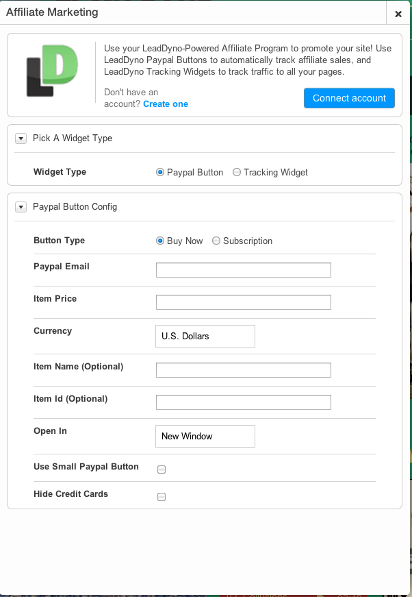

## Wix Integration Guide

### Introduction

LeadDyno offers a custom [Wix](http://www.wix.com) widget to allow you to run an affiliate program for your
Wix website.

The LeadDyno Affiliate Program widget will allow you to use either PayPal buttons on your Wix site **or** an
external shopping cart system such as [Shopify](http://www.shopify.com) that is properly integrated with
LeadDyno.

  <strong>Note:</strong> The LeadDyno widget will <strong>not</strong> work with the Wix Online Store widget,
  Shopify widget or any other e-commerce widgets.  We are working with Wix to address this, but unfortunately
  it will require changes to their API for us to track properly.  Please <a href="mailto:support@leaddyno.com">contact
  us</a> if you would like to be updated about future Wix/LeadDyno updates.

### Adding A LeadDyno Affiliate Widget

Search for the term 'Affiliate' in the Wix App Market, and select the **LeadDyno Widget**

and click **Add To Site**

You will then see a Paypal button that can be configured for selling your product.  If you are using an
external e-commerce system like Shopify, you can convert the Paypal button into an invisible tracking widget
following the **Adding A Tracking Widget** instructions below.

#### Connecting Wix With LeadDyno

You will now need to connect the widget to LeadDyno.  If you have a LeadDyno account, you can simply click the
"Connect To LeadDyno" button:

And then click the "Connect Wix And LeadDyno" button:

After you have connected, you can disconnect by clicking the "Disconnect Account" icon:

If you don't have a LeadDyno account, you will need to sign up for one by clicking the 'Create One Here' button:

And then go through the "Connect To LeadDyno" button as outlined above.

#### Configuring Paypal Button Options

You are now ready to configure your Paypal "Buy Now" Button options

* **Button Type** - Either 'Buy Now' or 'Subscription'
* **Paypal Merchant Email** - Your paypal email
* **Price** - The price of the item
* **Item Name** - The name of the item (as it will appear on PayPal)
* **Currency** - The currency of the price
* **Item ID** - An optional item ID
* **Open In** - How to open the Paypal webpage
* **Use Small PayPal Button** - Use a smaller paypal button (no credit card icons will be shown)
* **Hide Credit Cards** - Hide the credit card icons (if using the large paypal button

Once you are done configuring your Paypal button you can close the dialog.

### Converting To A Tracking Widget

If you are not using PayPal to sell your product, or if your PayPal buttons are not on your main landing page,
you will want to install a site-wide LeadDyno Tracking Widget.  This widget will be invisible to your visitors
but will capture their source properly.

To install a Tracking Widget, drag on another **LeadDyno Widget** from the Wix App Store.  Next, open up the
widget configuration window and select the **Trackin Widget** option:

The widget will look like this in your site building UI:

but will be **invisible** to visitors to your site.

Finally, check the "Show on all pages" box in the Wix config UI, which will place the tracking code on all
your pages and ensure traffic is properly tracked:

### Conclusion

And that's it!  You know have a fully functional affiliate program integrated with your Wix website!
