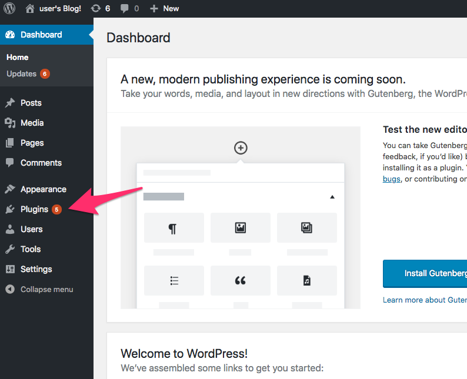
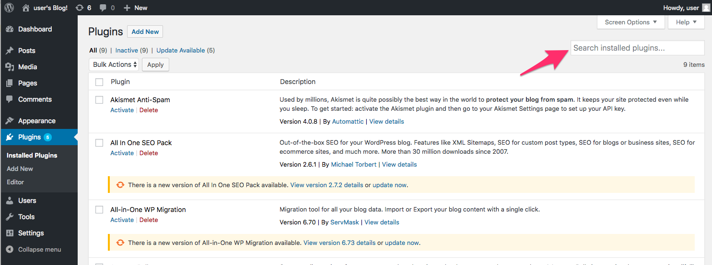
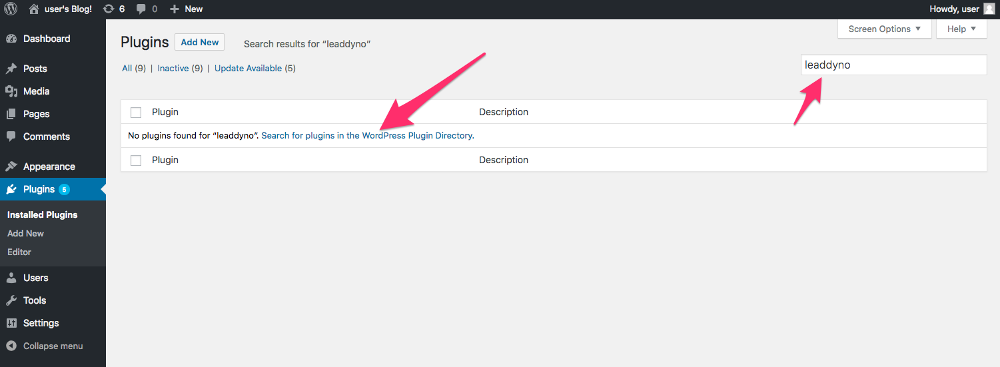
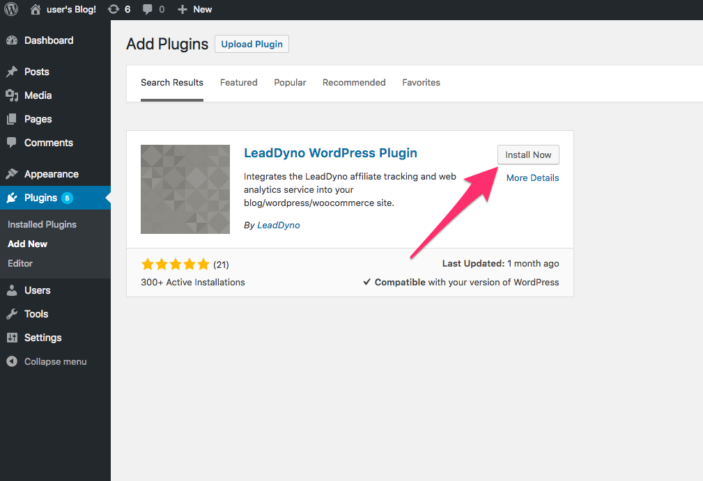
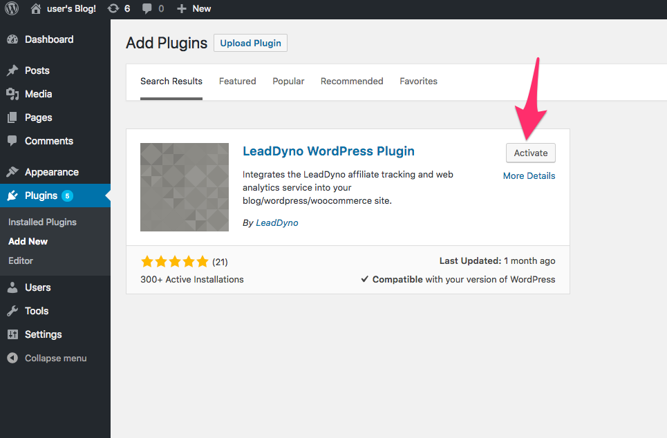
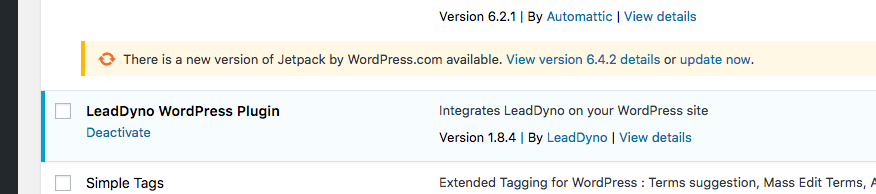
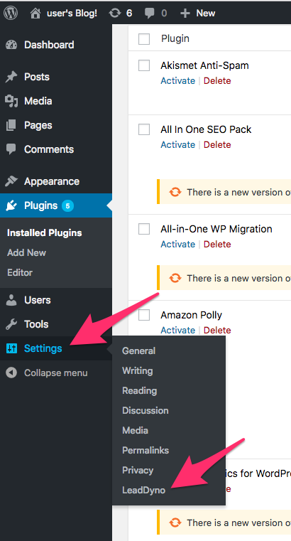
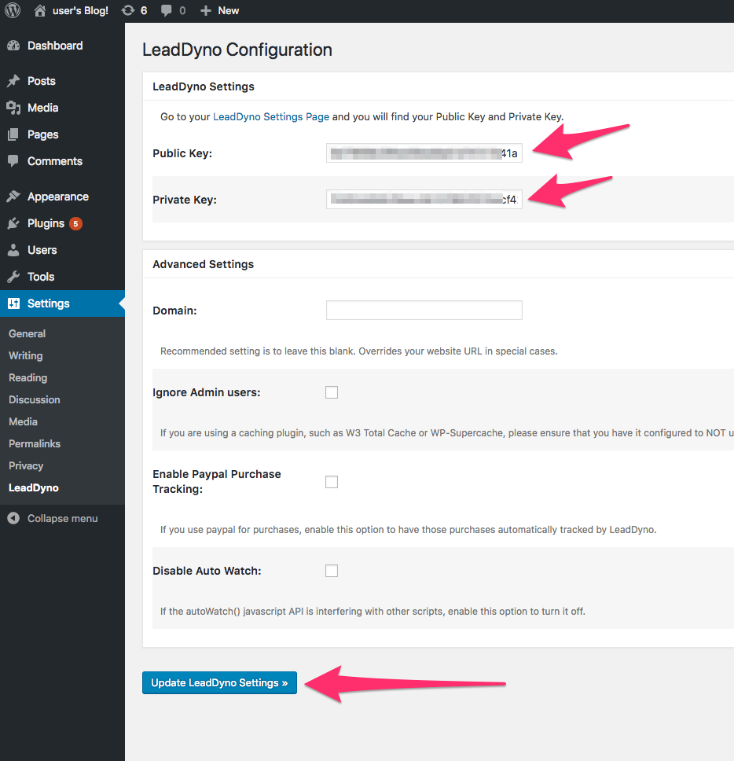
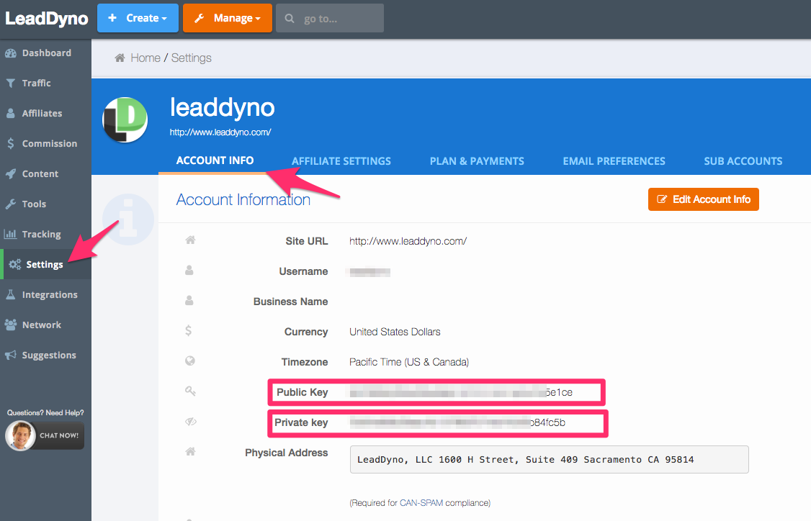

## Wordpress/WooCommerce Integration Guide

### Introduction

LeadDyno offers a custom [Wordpress Plugin](https://wordpress.org/plugins/leaddyno/) that allows you to install the 
LeadDyno tracking code very easily onto your wordpress powered website/blog and WooCommerce powered online store.

### Adding The LeadDyno Plugin To Your Wordpress Installation

Log into your wordpress admin dashboard. Once logged in, click the ***Plugins*** option from the left menu.

On the top right of the page, type ***leaddyno*** into the **Search installed plugins...** box and press enter.

The plugin will not be found because it has not been installed yet, so click the ***Search for plugins in the Wordpress 
Plugin Directory*** link. 

From the search results, select the ***Install Now*** button from the ***LeadDyno Wordpress Plugin*** box.

After the plugin is installed, you then need to click the ***Activate*** button.

The plugin is now installed and will appear in the installed plugins list.

You now need to configure the plugin with your LeadDyno public and private API keys. Select the ***Settings*** option
on the left menu, and click the ***LeadDyno*** link.

Insert your LeadDyno ***Public*** key into the ***Public Key*** field, and your ***Private*** key into the ***Private Key***
field and then click ***Update LeadDyno Settings***.

To get your LeadDyno public and private keys, visit the [LeadDyno Settings](https://app.leaddyno.com/settings/account) page
in the LeadDyno application.

### Conclusion

That's it! LeadDyno is now configured on your website to track visitors and leads. If your wordpress site is WooCommerce
enabled, it will also capture purchases and upload the purchase information to your LeadDyno account.