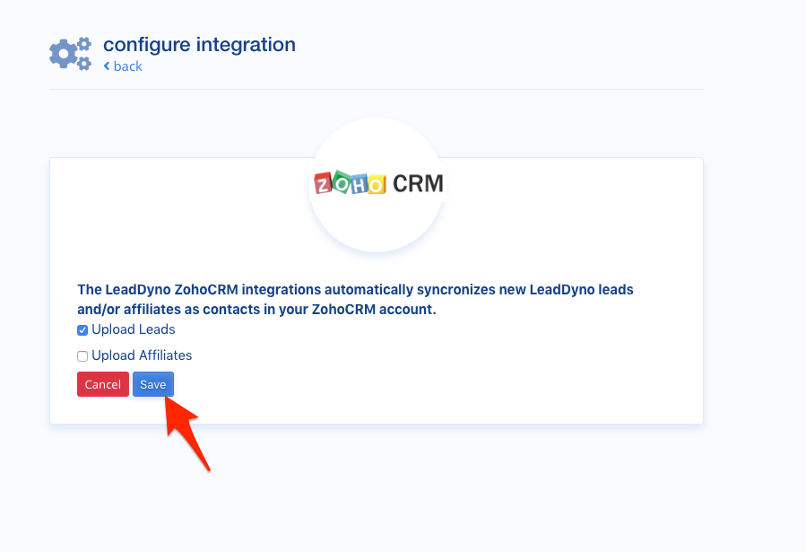

## ZohoCRM Integration Guide

### Introduction

LeadDyno offers a single-click integration with ZohoCRM, allowing instant lead creation in ZohoCRM whenever LeadDyno
captures a lead or signs up a new affiliate.

### Connecting To ZohoCRM

First visit the **CRM Services** Tab of the Apps section:

Or click [Here](https://app.leaddyno.com/integrations/store#apps-crm) if you already have a LeadDyno account.

Find the ZohoCRM app, and click **Add**.

You will be redirected to ZohoCRM, possibly being asked to login if you are not already logged in. 

You will then be asked to grant permission to the LeadDyno app. Click **Accept**.

After a brief pause, you will be redirected back to LeadDyno, which should show you as connected:

### Lead/Affiliate Uploading

By default, LeadDyno will upload new leads to your ZohoCRM account as a new **lead**. You can also choose to have new affiliates uploaded
as a new **contact** record. Click the **Edit** button on the ZohoCRM app.

Check the boxes for which types of records to upload and click **Save**.

That's all there is to it!

### Conclusion

At this point LeadDyno will upload new leads and/or affiliates to your ZohoCRM account automatically!
